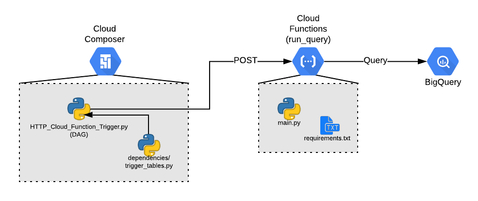

# Flow from Composer to Function to BQ

Apache Airflow is an excellent orchestration and scheduling tool, but having to maintain a GCP Cloud Composer environment with the resources to run complex processes can be costly. Additionally, rewriting a script to create a DAG can overcomplicate the code. The outlined approach takes a script that would easily run locally, but instead embeds it in an HTTP trigger Cloud Function. From there, the Airflow DAG only needs to send an HTTP request to the function to run it. 

This example takes the above logic, except the Cloud Function script triggers a BigQuery query. To make the query more dynamic, a dependencies file in the Cloud Composer dag directory passes a table name that the Cloud Function uses in the BQ query.

